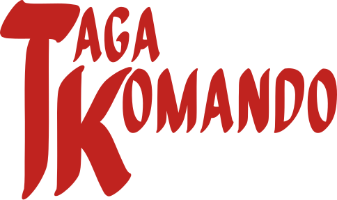

<p align="center">
  
</p>

Squad-based real-time tactics game for Windows. Luzon, 1941–45.

*Factions are dramatized. The battles and places are inspired by real events on Luzon, 1941–45.*

Version 0.5.4 · Campaign, Theater of War and Skirmish vs. AI · Offline

---

## Where to get things

- **The game (Windows):** [Releases page](https://github.com/og-cz/taga-komando/releases)
  - `TagaKomando-Setup-<version>.exe`: installer (Start menu shortcut, uninstaller)
  - `TagaKomando-Portable-<version>.exe`: single file, no install, runs from anywhere
- **Source code:** https://github.com/og-cz/taga-komando
- **Node.js 22 or newer** (only needed to build from source): https://nodejs.org (choose "LTS")
- **Git** (only needed to build from source): https://git-scm.com/downloads
- **Bug reports / suggestions:** https://github.com/og-cz/taga-komando/issues

## System requirements

- Windows 10 or 11, 64-bit
- 4 GB RAM
- 400 MB disk space
- Screen 1280×720 or larger
- Mouse with right button (middle button optional)

## Install

**Installer:** run `TagaKomando-Setup-<version>.exe`, choose a folder, finish. Start from the Start menu.

**Portable:** put `TagaKomando-Portable-<version>.exe` anywhere and double-click it.

**"Windows protected your PC" warning:** the app isn't code-signed yet. Click **More info → Run anyway**.

**Uninstall:** Settings → Apps → Taga Komando → Uninstall. The portable version: delete the file.

## Game modes

Pick a mode from the main menu.

**Campaign**: the defence and liberation of Luzon, played in order. Each mission unlocks the next.

| # | Mission | Date | Type |
| --- | --- | --- | --- |
| 1 | Withdrawal to Bataan | December 1941 | Annihilation: destroy the enemy vanguard |
| 2 | Layac Junction | 6 January 1942 | Defense: hold the stone bridge against 6 waves |
| 3 | Mount Samat | April 1942 | Defense: hold the summit against 10 waves |
| 4 | The Road to Manila | January 1945 | Offensive: take Route 3 town by town to the Calumpit bridge |

**Theater of War**: four operations you can replay on any difficulty. Win on Easy, Normal and Hard for Bronze, Silver and Gold medals.

- **Defend the City** (City Defense): hold the Plaza de Roma inside the walls of Intramuros against 8 waves coming through three gates.
- **Hold the Summit** (Hill Defense): defend a hilltop against 8 waves.
- **Highway 3 Assault** (Highway Assault): break 4 fortified positions along a highway before time runs out.
- **Battle for Luzon** (Historical Skirmish): a full battle on historical ground with the victory condition of your choice.

**Skirmish**: a match against the AI on a map of your choice, with a victory condition of your choice:

- **Capture Points:** holding more victory points drains the enemy's 500 tickets.
- **Annihilation:** wipe out the enemy army (every unit, nothing left in production).
- **None:** no tickets or time limit.

Whatever the condition, destroying the enemy headquarters always wins.

How the mission types work:

- **Defense:** keep the marked **HOLD** point. Waves come on a timer and get stronger. You lose if the point falls.
- **Offensive:** capture the marked **OBJECTIVE** sectors in order. Each one adds 3 minutes and moves your reinforcement point forward. The enemy counterattacks.
- **Battle / Skirmish:** won by the chosen victory condition (Capture Points, Annihilation or None).

## How to play

1. Choose a mode, then a mission or map and the difficulty, then press **Deploy**.
2. Capture points with infantry. Vehicles can't capture.
3. Complete the mission objective shown at the top of the screen.
4. Destroying the enemy HQ always wins; losing yours always loses.

**Resources**

- **Manpower (MP):** builds and reinforces units. Comes from the base; upkeep grows with army size.
- **Munitions (MU):** grenades and barrages. From munitions points (**M**).
- **Fuel (FU):** tanks. From fuel points (**F**).
- A point only pays out while it is connected to your HQ through territory you own. A struck-through point is cut off.

**Cover** (the dots under the cursor show where soldiers will stand):

- Green = heavy cover (sandbags, stone walls, buildings)
- Yellow = light cover (hedgerows, craters, jungle)
- Red = exposed (rice paddies make soldiers easier to hit)
- Cover only protects against fire from the far side of it.

**Tips**

- Machine guns pin infantry inside their firing cone. Flank them or throw a grenade.
- Mortars need a friendly unit to see the target.
- Tanks have thin rear armour. Hit them from behind.
- Retreat (**R**) damaged squads before they're wiped out, then reinforce (**E**) at the HQ. A retreat can't be cancelled: the squad takes no other orders until it gets home.
- Engineers fortify ground: sandbags give heavy cover, barbed wire stops infantry (tanks crush it), tank traps stop tanks, mines wreck whatever steps on them. They also repair tanks and the HQ.
- Give a rifle squad one weapon upgrade (**T / Y**) near the HQ: a bazooka or AT rifle against tanks, a BAR or light MG against infantry.

## Controls

| Key / mouse | Action |
| --- | --- |
| Left-click / drag | Select units (Shift adds; double-click selects the same unit type) |
| Right-click | Move, or attack the enemy under the cursor (Shift queues) |
| Right-click + drag | Move there and face the drag direction. Machine gun and mortar teams set up aimed that way; the firing cone shows while you drag |
| A | Attack-move |
| S | Stop |
| R | Retreat to HQ |
| E | Reinforce |
| D | Set up / tear down machine gun and mortar teams (shows the firing cone; click to aim) |
| G | Grenade |
| B | Mortar barrage |
| Z / X / C / V | Engineers: sandbags / barbed wire / tank traps / mine (drag to lay a line; Shift keeps placing) |
| F, then click a damaged tank, HQ or defense | Engineers repair it (right-click works too) |
| Right-click an unfinished defense | Selected engineers help build it |
| Click a defense or mine | Show its health and details |
| T / Y | Weapon upgrade for the selected rifle squad (near HQ or a supplied point) |
| H | Select HQ (right-click then sets the rally point) |
| Ctrl + 1–9 / 1–9 | Assign / select control group (double-tap to jump) |
| Space | Tap: centre on selection. Hold + left-drag: grab and move the map |
| Arrow keys, screen edge, middle-drag | Scroll |
| Mouse wheel | Zoom |
| F11 or Alt+Enter | Fullscreen |
| Esc or P | Pause menu |
| F1 | Controls |

## Units

| Role | Hukbong Maharlika | Imperial Army |
| --- | --- | --- |
| Rifle squad | Rifle Squad: 5 men, grenades; upgrade Bazooka or BAR | Hohei Rifle Squad: 6 men, grenades; upgrade Type 99 LMG or AT rifle |
| Engineers | Combat Engineers | Kohei Engineers |
| Machine gun | M1917 HMG Team | Type 92 HMG Team |
| Mortar | 60mm Mortar Team | Type 97 81mm Mortar Team |
| Anti-tank | Bazooka Squad | AT Rifle Team |
| Tank | M3 Stuart | Type 97 Chi-Ha |

### Unit roles

No unit is simply the strongest. Each one has a job and a threat:

| Unit | Strong against | Weak against |
| --- | --- | --- |
| Rifle squad | Weapon teams from the flank, other infantry (grenades flush dug-in crews) | Machine guns from the front, tanks |
| Machine gun team | Infantry inside its firing cone | Mortars, flanking infantry, tanks |
| Mortar team | Set-up weapon teams, infantry in cover | Infantry rushes (it cannot fire at close range), tanks; needs a spotter |
| Anti-tank squad | Tanks, especially from the side or rear | Infantry and machine guns |
| Tank | Infantry and weapon teams | Anti-tank squads, shots to its thin rear armour |
| Engineers | Fortifying ground, keeping tanks in the fight | Any real firefight |

Machine guns turn slowly once set up, so attacking them from the side works. The unit card and every build button show these strengths and weaknesses.

**Maps:**
- Skirmish: Bataan Crossroads, Barrio San Roque, and thirteen Luzon towns: Calumpit, Plaridel, Pilar, Orani, Porac, Abucay, San Fernando, Dinalupihan, Hermosa, Guagua, Lingayen, Baliuag and Lubao (river towns, coast, jungle and open farmland).
- Missions: Intramuros (a walled city on the bay), Mount Samat, Route 3 and Layac Junction, plus Calumpit and San Fernando for the open battles.

## Changelog

**0.5.4**
- Several units of the **same type** keep their shared abilities and special orders, like CoH2; only a mixed group is limited to attack-move, stop and retreat.
- The README shows the Taga Komando logo.

**0.5.3**
- **Repair order** for engineers (F): click it, then click the damaged tank, HQ or defense. Engineers do not fight while they repair or build.
- With a **mixed group selected**, only the common orders show (attack-move, stop, retreat), like CoH2.
- **Surrender** from the pause menu ends the battle on the defeat screen.
- The camera starts closer and zooms in further.

**0.5.2**
- Queues belong to units again, like CoH2: the queue slots show the selected unit's own jobs. Select the HQ (or nothing) for its recruits, or a squad for its upgrade and reinforcements. The HQ recruits up to three units at a time; squads upgrade and reinforce on their own.
- Roster cards at the top right show a squad reinforcing (+, green bar) or upgrading (⇪, orange bar).

**0.5.1**
- Tighter, more focused maps: every town and mission map is zoomed in (houses are two or three tiles across) and cropped around the town, close to the size of the original battlefields.
- The towns look fought over: shell craters in clusters along the front, sandbag lines dug in around the capture points, hedgerows between the paddies and ruined houses.
- Mission objectives, spawns and starting positions re-placed for the new layouts.

**0.5.0**
- **Thirteen new Luzon town maps** for skirmish: Calumpit, Plaridel, Pilar, Orani, Porac, Abucay, San Fernando, Dinalupihan, Hermosa, Guagua, Lingayen, Baliuag and Lubao. River towns with bridges, coastal towns, jungle villages, farmland and a big town, built from Watabou's Village Generator.
- Bases and capture points on the new maps are placed by driving distance, so both sides have an equal claim; every point has a local name (Poblacion, Simbahan, Palengke, Bodega, Gasolinahan…).
- **New maps for every campaign and Theater of War mission**, also from Watabou's generators: Intramuros is now a walled city on the bay with Fort Santiago in its walls (from the City Generator); Mount Samat, Route 3 and Layac Junction are new villages with hand-placed objectives; Withdrawal to Bataan is fought at Calumpit and Battle for Luzon at San Fernando.
- **One queue for everything:** recruiting, weapon upgrades and reinforcements all run in the three queue slots beside the orders, three jobs at a time. Each slot shows its progress (⇪ upgrade, + reinforcing); click one to cancel it.
- The skirmish battlefield list is a grid of map thumbnails.
- New app icon: TK with a kris.

**0.4.1** (0.4.0 was not released; everything since 0.3.5 is here)
- **Engineers** (Combat Engineers / Kohei Engineers) build **sandbags**, **barbed wire**, **tank traps** and **mines** (Z / X / C / V; drag to lay a line). An abandoned job is refunded.
- Engineers **repair** tanks, the HQ and damaged defenses: right-click the damaged one.
- **Defenses have health.** Bullets can't hurt them; explosives wear them down (sandbags take about six mortar hits, tank traps far more, wire much less). Click one to see its health.
- Several engineer squads can **build together**: select more engineers and right-click an unfinished job to send them to help.
- The HQ **production queue** is three slots beside the orders; click one to cancel it with a full refund.
- Reinforcements arrive more slowly (one soldier every 5.5 seconds).
- **Weapon upgrades** for rifle squads (T / Y): Bazooka or BAR for the Maharlika, Type 99 light MG or Type 97 AT rifle for the Imperial Army. One per squad; reinforcements replace the upgraded weapon first.
- The AI builds engineers to repair its tanks, and buys upgrades.
- New Taga Komando logo on the title screen and main menu, a new app icon, and the OGCZ logo on the startup screen.
- Attacking waves in Theater of War push forward instead of trading fire from long range.
- Destroying the enemy headquarters now wins in every mode.
- Hold **Space** and drag with the left mouse button to grab and move the map.

**0.3.5**
- Retreat is binding: a retreating squad takes no other orders until it reaches headquarters.
- **Unit counters:** every weapon now hits infantry, weapon teams, vehicles and buildings differently, so each unit has clear strengths and weaknesses (see *Unit roles*). Machine guns turn slowly, mortars cannot fire at close range, bazookas kill tanks faster.
- **In Progress panel:** units being recruited, queued units and squads reinforcing each show a progress bar, time left and (for purchases) cancel with refund. Roster cards and the unit card show reinforcement progress.

**0.3.4**
- The Filipino faction is now called **Hukbong Maharlika** (Maharlika Army).
- New victory conditions: **Capture Points**, **Annihilation** and **None**, chosen in Skirmish and in the Battle for Luzon operation.
- Campaign mission 1, *Withdrawal to Bataan*, is now an annihilation battle.
- **Right-click drag** to move and face: machine gun and mortar teams set up aimed that way, and their firing cone shows while you drag. **Set Up (D)** shows the live cone too.
- New in-game HUD: objective and timer top centre, unit roster top right, minimap, unit portrait card and command card along the bottom, with rich tooltips.
- Theater of War redesigned as four operation cards: City Defense, Hill Defense, Highway Assault and Historical Skirmish.
- New map: **Intramuros**, the walled city of Manila, for the new **Defend the City** operation (replaces Defend the Barrio).
- New terrain: fortress walls that cannot be climbed or seen through.

**0.3.0**
- The game is now called **Taga Komando**. Saved campaign progress and medals carry over.
- The splash screen now reads **OGCZ presents**.
- A crash in one frame no longer freezes the match; the game keeps running and shows the error.
- Desktop app: **F12** opens the developer console for bug reports.

**0.2.0**
- New main menu with a cinematic startup: studio card, title screen and a live battle in the background.
- Three modes: **Campaign** (4 historical missions), **Theater of War** (3 replayable operations with medals) and **Skirmish**.
- New mission types: **Defense** (survive waves) and **Offensive** (capture sectors in order against the clock).
- New maps: Mount Samat and Route 3.
- Mission briefings before every campaign and Theater of War mission.
- New result screens: Victory in gold on white, Defeat in red on black. Retry or continue straight from the result.

**0.1.0**
- First playable release: skirmish vs. AI, 2 factions, 10 unit types, 2 maps.

## Credits

- Town maps: generated with Watabou's **Village Generator** (https://watabou.itch.io/village-generator) and **Medieval Fantasy City Generator** (https://watabou.itch.io/medieval-fantasy-city-generator) and converted into battlefields. Watabou's maps are free to use; thank you.
- Display font: **Quiapo Free** by Aaron Amar (http://be.net/aaronamar), used under the SIL Open Font License 1.1. The licence text ships with the game in `licenses/Quiapo-OFL.txt`.

## Troubleshooting

- **Window opens blank:** update your graphics driver, then restart the game.
- **Game runs slowly:** close other heavy programs and update your graphics driver.
- **Keyboard doesn't respond:** click inside the game window once to focus it.
- **Menu choices reset:** the last faction, map and difficulty are saved automatically; this is normal after a reinstall.

---

## Build from source

Needs Node.js and Git (see [Where to get things](#where-to-get-things)).

```bash
git clone https://github.com/og-cz/taga-komando.git
cd taga-komando
npm install
```

If npm skipped Electron's download step, fetch the runtime once:

```bash
node node_modules/electron/install.js
```

| Command | Result |
| --- | --- |
| `npm run app` | Build and open the game in a desktop window |
| `npm run dist` | Create the installer and portable `.exe` in `release/` |
| `npm run dev` | Development server with live reload (opens in a browser) |
| `npm test` | Run the game-logic tests, including full AI-vs-AI matches |
| `npm run typecheck` | Type-check the code |

**Project layout**

```
electron/   desktop window
src/data/   all unit, weapon, map and balance numbers (edit these to rebalance)
src/sim/    game rules: movement, combat, cover, suppression, vision, territory, economy
src/ai/     computer opponent
src/render/ drawing
src/ui/     menus and HUD
src/input/  mouse and keyboard
tests/      automated tests
tools/      map converter for Watabou village exports
```

**Adding a town map**

1. Open https://watabou.github.io/village-generator/, make a village you like, then right-click the map → *Export as* → *JSON*.
2. On the same page, open the browser console, paste in `tools/watabou-to-grid.js`, and run `copy(JSON.stringify(watabouToGrid(<the exported JSON>)))`.
3. Save the rows in `src/data/luzon/<town>.ts` and add an entry for the town in `src/data/luzonMaps.ts` (name, description, point names).
4. Run `npm test`. Bases and capture points are placed automatically, and the tests check that every point can be reached by infantry and tanks from both bases.

